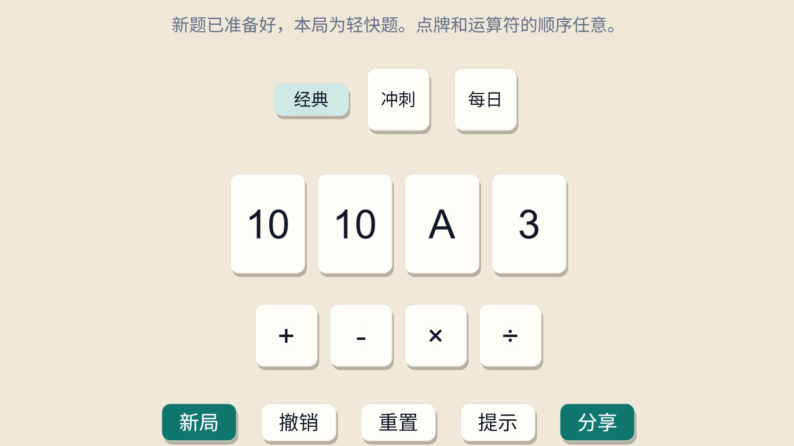
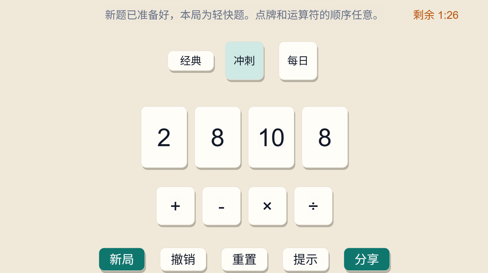
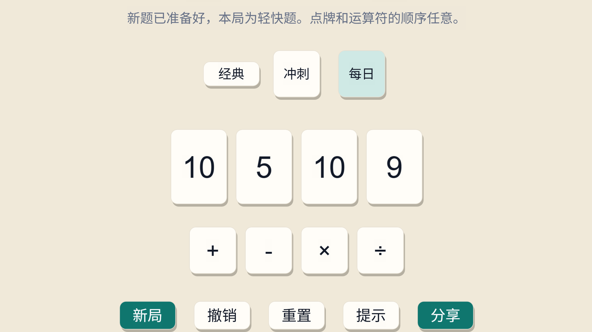
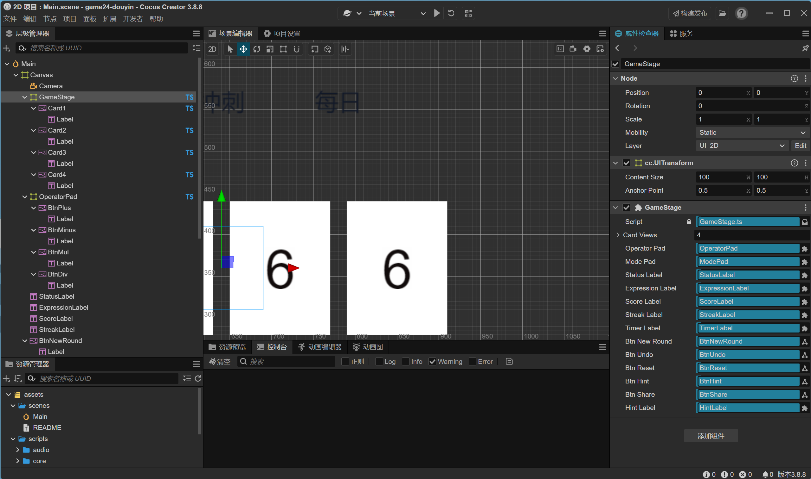

# GameStage_24

> English | [简体中文](./README.md)

> A Douyin Mini Game built with Cocos Creator + TypeScript that delivers the classic "24 points" puzzle with zero floating-point error, network-wide daily synchronization, and graceful ad failure handling.


<p align="center">
  
</p>

---

## Table of contents

- [Why I built this](#why-i-built-this)
- [Gameplay + three modes](#gameplay--three-modes)
- [Try it now](#try-it-now)
- [Architecture](#architecture-core-logic-with-zero-platform-dependencies)
- [Technical highlights](#technical-highlights)
  - [1. DFS backtracking solver + a custom Fraction class (the core)](#1-dfs-backtracking-solver--a-custom-fraction-class-the-core)
  - [2. Hash-seeded "Daily Challenge" — zero server involvement](#2-hash-seeded-daily-challenge--zero-server-involvement)
  - [3. Douyin platform adapter + rewarded video ad fallback](#3-douyin-platform-adapter--rewarded-video-ad-fallback)
- [Project structure](#project-structure)
- [Local development](#local-development)
- [Contributing](#contributing)
- [Known issues](#known-issues)

---

## Why I built this

"24 points" is essentially a national pastime in the Chinese-speaking world, but the mini-game versions on the market all share two chronic problems:

1. **The solver uses floating-point numbers**, so a puzzle like `(3 / 7) x 7 x 4 = 24` gets misclassified as "no solution". As a workaround, level generation falls back to a small hand-written deck pool, and long-term players keep seeing the same hands over and over.
2. **Daily Challenge is either missing or requires a backend.** For a solo developer shipping a backendless mini game, the "everyone gets the same puzzle today" feature is usually the first thing cut.

GameStage_24 is built to prove that both problems can be solved cleanly on the client with a modest codebase. The whole project — core algorithm, state machine, and Douyin integration — fits in fewer than 30 TypeScript files.

---

## Gameplay + three modes

Draw 4 playing cards (A=1, J/Q/K=11/12/13) and use `+`, `-`, `x`, `/` plus parentheses to make exactly 24. Every card must be used exactly once. Three modes are available: Classic (endless puzzles), Time Attack (90-second sprint), and Daily Challenge.

| Classic | Time Attack | Daily Challenge |
|:---:|:---:|:---:|
|  |  |  |

---

## Try it now

> Current status: **single scene built, not yet launched**. See [Known issues](#known-issues).

| Platform | How to try it today | Notes |
|---|---|---|
| **Douyin Mini Game** | Not yet available in Douyin search | No submission to ByteDance Developer Console yet; once listed, search keywords will be 「算24点」/「数24点」 |
| **Browser preview** | Cocos Creator 3.8.8 → open this directory → Preview in browser | The `isWeb()` branch activates, storage uses `localStorage`, and rewarded video auto-degrades to the `'no-sdk'` branch (see [Highlight 3](#3-douyin-platform-adapter--rewarded-video-ad-fallback)) |

> No server dependency — the Daily Challenge hand is generated locally from a date seed via a PRNG ([Highlight 2](#2-hash-seeded-daily-challenge--zero-server-involvement)), so the game runs fully offline.

---

## Architecture: core logic with zero platform dependencies

The project is strictly layered by dependency direction, as documented in `assets/scripts/README.md:11`:

```
ui  --->  state  --->  core
                  --->  platform  --->  Douyin tt.*  /  browser localStorage  /  in-memory fallback
```

- `core/`: fraction arithmetic, DFS solver, deal generation, seeded RNG, scoring — **pure TypeScript, never imports `cc.*` or `tt.*`**.
- `state/`: reducer + Store state machine. Action in, state + effects out. Engine-agnostic.
- `platform/`: a thin adapter layer over the Douyin SDK. Every capability has a "no-SDK fallback" branch.
- `ui/`: the only layer allowed to touch Cocos Creator node APIs.

Direct benefits of this constraint:

- **The solver runs as a Node unit test** without booting the editor.
- **The same logic runs identically inside the Douyin runtime, the Cocos editor preview, and a plain browser debug page.** `tt-env.ts:1` probes the runtime via the presence of `globalThis.tt`, and downstream modules branch accordingly.
- **Low cost to port to other platforms.** To target WeChat / Kuaishou mini games, in theory only `platform/` needs to be swapped out.

Below is the scene structure inside the Cocos Creator editor: the `GameStage` node holds references to every UI node (`Card1-4` / `OperatorPad` / `ModePad` / status labels…) via the Inspector on the right, and the state-machine layer writes reducer output onto those nodes — the UI is a pure function of state, components themselves hold no domain state.

<p align="center">
  
</p>

---

## Technical highlights

### 1. DFS backtracking solver + a custom Fraction class (the core)

**Problem.** Generating valid 24-point puzzles requires a 100%-accurate solver to filter out unsolvable hands. The naive approach treats each card as a `number` and uses DFS to enumerate every operator combination, checking whether the result equals 24. But floating-point is a trap here:

```
(3 / 7) x 7 x 4
Float:   0.42857142857142855 x 7 x 4 = 11.999999999999998
Compare: Math.abs(11.999... - 24) > any reasonable epsilon? Depends on your epsilon.
```

Make `epsilon` too large and you get false positives / negatives; too small and accumulated error misjudges valid answers. For a puzzle generator, that flakiness means the deck pool occasionally serves hands where "the player solved it but the system said wrong" or "the system says unsolvable when there is a solution".

**Solution 1 — Fraction class.** Represent every intermediate value as an integer fraction `{num, den}` and normalize via `gcd` after each operation. All four arithmetic operations stay in integer arithmetic and dodge floating-point entirely. See `assets/scripts/core/fraction.ts:6-38`:

```ts
export function operateFractions(left, right, op) {
  if (op === '+') return normalizeFraction(left.num * right.den + right.num * left.den, left.den * right.den);
  if (op === '*') return normalizeFraction(left.num * right.num, left.den * right.den);
  if (op === '/') {
    if (right.num === 0) return null;  // Divide-by-zero safe: returns null so the DFS prunes the branch automatically
    return normalizeFraction(left.num * right.den, left.den * right.num);
  }
  // ...
}
```

The "equals 24" check is no longer a floating-point comparison either — it becomes a strict integer equality `nodes[0].num === 24 * nodes[0].den` (solver at `solver.ts:38`). Zero false positives.

**Solution 2 — DFS.** Given N fractions in hand, pick any two `(L, R)`, apply one operation, push the result back, and recurse on the now `N-1` fractions. When `N` reaches 1, run the equality check. Non-commutative operations (`-` and `/`) must be tried in both orderings `L op R` and `R op L`, so each pair has 6 merge variants. See `assets/scripts/core/solver.ts:36-66`:

```ts
function dfs(nodes: SearchNode[]): void {
  if (nodes.length === 1) {
    if (nodes[0].num === 24 * nodes[0].den) solutions.add(trimOuterParentheses(nodes[0].expr));
    return;
  }
  for (let first = 0; first < nodes.length; first++) {
    for (let second = first + 1; second < nodes.length; second++) {
      // 6 combinations: L+R, L-R, R-L, L x R, L / R, R / L
      tryOp(operateFractions(L, R, '+'), ...);
      tryOp(operateFractions(L, R, '-'), ...);
      tryOp(operateFractions(R, L, '-'), ...);
      // ...
    }
  }
}
```

**Walkthrough.** Input `[3, 3, 7, 7]` (a classic nasty hand, listed in the advanced pool at `constants.ts:20`):

```
One DFS path:
  pick (3, 7) -> 3 / 7 = {num: 3, den: 7}        remaining [{3/7}, 3, 7]
  pick ({3/7}, 3) -> 3/7 + 3 = {num: 24, den: 7} remaining [{24/7}, 7]
  pick ({24/7}, 7) -> 24/7 x 7 = {num: 168, den: 7} = {num: 24, den: 1}
                                       └─ 24 === 24 x 1  HIT

Solution: (3 + 3 / 7) x 7 = 24    (A floating-point solver computes 23.999... and reports "no solution")
```

A float-based solver misses this hand; the fraction-based solver finds it reliably. `solver.ts:130` also exploits the solution count for difficulty grading: <=3 solutions tags "Tricky" (+90), <=8 tags "Advanced" (+60), otherwise "Easy" (+30). Because the solver runs on the client, this difficulty label is a real measurement of the hand, not a guess.

The same solver, `findSolutionPath()` (`solver.ts:68`), carries an extra `id` field to produce step-by-step hints — "which two cards to combine next and how" — fed to the reducer (see highlight 3 for the ad-failure fallback).

---

### 2. Hash-seeded "Daily Challenge" — zero server involvement

**Problem.** Every player who opens the app today must see the exact same puzzle; tomorrow, a different one. The standard answer is a backend that maintains a question bank and pushes one per day. But for a mini game, standing up a backend is operationally not worth it.

**Solution.** Treat "today's date" as a seed and use a deterministic algorithm to generate the same puzzle locally on every device.

`seed.ts:8` uses FNV-1a to hash the date string (`YYYY-MM-DD`) into a 32-bit integer:

```ts
export function createSeedFromText(text: string): number {
  let seed = 2166136261;            // FNV offset basis
  for (let i = 0; i < text.length; i++) {
    seed ^= text.charCodeAt(i);
    seed = Math.imul(seed, 16777619); // FNV prime
  }
  return seed >>> 0;
}
```

Then `seed.ts:17` seeds a reproducible mulberry32-style PRNG:

```ts
export function createSeededRandom(seed: number): () => number { /* mulberry32 */ }
```

Finally `deal.ts:83` chains "date -> seed -> PRNG -> shuffle -> take first 4 -> solver-filter" together:

```ts
const rand = createSeededRandom(createSeedFromText(`24-daily-${dateKey}`));
for (let attempts = 0; attempts < 2000; attempts++) {
  const hand = shuffleWithRandom(deck, rand).slice(0, 4);
  const solutions = solve24(hand);
  if (solutions.length > 0) return { dateKey, ranks: hand.map(c => c.rank), solutions };
}
```

As long as the system clock isn't off by a day, every player worldwide sees the same hand today. **This pipeline also reverse-validates highlight 1's solver:** if the solver were to misjudge a hand as unsolvable, the PRNG would skip it and shift today's puzzle relative to other players. Today's and tomorrow's puzzles would diverge across devices.

**Trade-off** (I thought about this one a lot):

| | Seed-based (local) | Server-pushed |
|---|---|---|
| Backend cost | 0 | API + question table + deployment |
| Editorial control | At the PRNG's mercy; can't hand-place holiday specials | Fully controllable |
| Client clock attack | Changing local time previews tomorrow's puzzle | Clock-attack resistant |
| Puzzle A/B / hot patching | Not feasible | Anytime |

For a solo-developed casual mini game, editorial control over the daily puzzle is low-value — nobody is going to roll their system clock forward to play 24 points a day early. So I went with the seed approach. If the product pivots toward competitive play, swap to server-pushed puzzles; there's exactly one call site at `deal.ts:103` to change.

---

### 3. Douyin platform adapter + rewarded video ad fallback

**Design principle.** Every module in `platform/` is one interface with three implementations — Douyin runtime, browser, in-memory fallback. Runtime probing lives in `tt-env.ts:3`:

```ts
export function getTT(): any | null {
  const t = globalThis.tt;
  return t && typeof t === 'object' ? t : null;
}
```

Business code calls `getJSON('records', defaults)`, `showRewardedAd('hint')`, `shareAppMessage(...)` and **does not care which host it's running on**. For storage, see `tt-storage.ts:5`:

```ts
export function getItem(key: string): string | null {
  const tt = getTT();
  if (tt) return tt.getStorageSync(key);            // Douyin
  if (isWeb()) return localStorage.getItem(key);    // Browser debug
  return memoryStore.get(key) ?? null;              // Fallback: editor, SSR, tests
}
```

**Rewarded video ad fallback** (the important part). On real Douyin devices, `tt.createRewardedVideoAd` may fail to load, the user may close mid-roll, or the SDK may be unavailable — all expected failure modes. `tt-rewarded-ad.ts:39` collapses every failure into a 4-value enum:

```ts
export type AdResult = 'reward' | 'cancel' | 'error' | 'no-sdk' | 'not-ready';
```

The caller, `GameStore.useHint()` (`GameStore.ts:191-215`), branches on the result with tailored copy and **never blocks gameplay**:

```ts
const result = await showRewardedAd('hint');
if (result !== 'reward') {
  this.state.statusText = result === 'cancel'
    ? 'Ad was closed early. No new hint unlocked.'
    : 'Ad failed to load. Please try again later.';
  return;  // Game continues; the player figures out the next move themselves
}
this.dispatch({ type: 'USE_HINT' });
```

Two details worth calling out:

- **First hint is free; the second one requires watching an ad.** `GameStore.ts:201` does a double check with `count >= 1 && isDouyin()`. In the editor or browser, ad loading is never even attempted (it couldn't succeed anyway), and the hint feature works normally — which is exactly the development-experience payoff promised by highlight 1's "core logic runs everywhere".
- **The hint content isn't canned copy. It's the actual optimal next move for the current board, computed by the DFS solver.** `findSolutionPath` is wrapped in `hintGenerator.ts` and feeds the reducer's `USE_HINT` branch (see `roundReducer.ts:281`). So a failed ad doesn't cost the player "a wasted ad view"; it costs them "no solver-grade next-step suggestion" — which is a fair trade.

---

## Project structure

```
Point24/
├── assets/
│   ├── scripts/
│   │   ├── core/                   # Pure TS algorithm layer (fraction / solver / seed / deck / deal / scoring)
│   │   │                           # Zero platform dependencies — runs as Node unit tests
│   │   ├── state/                  # reducer + Store (roundReducer / GameStore / hintGenerator / timer)
│   │   │                           # Action in, state + effects out. Engine-agnostic.
│   │   ├── platform/               # Douyin tt.* adapter + browser / in-memory fallbacks
│   │   │                           # tt-env / tt-storage / tt-rewarded-ad / tt-share / tt-audio / tt-banner
│   │   ├── ui/                     # Cocos components (GameStage / CardView / OperatorPad / ModePad / theme)
│   │   └── audio/                  # SoundManager
│   └── scenes/                     # Cocos scenes (GameStage main scene)
└── package.json                    # Cocos Creator 3.8.8 project descriptor
```

Hard dependency constraint: `ui → state → core`; `platform` is its own layer; `core` must never import `cc.*` or `tt.*` (see `assets/scripts/README.md:11`).

---

## Local development

Environment:

- Node 16+
- Cocos Creator 3.8.8 (`package.json:5`)
- TypeScript (`tsconfig.json` extends the Cocos-generated `temp/tsconfig.cocos.json`)

Run it:

1. Open this directory with Cocos Creator 3.8.8.
2. Preview directly in browser — the `isWeb()` branch activates, storage uses `localStorage`, rewarded video auto-degrades to the `'no-sdk'` branch.
3. Build for Douyin Mini Game: menu → Project → Build, then pick platform `bytedance-mini-game`.
4. Optional core-algorithm unit tests: because `core/` has no Cocos dependency, you can run `npm test` or `vitest` directly on `core/*.ts` in Node.

---

## Contributing

Issues and PRs welcome. Before you start:

- **Open an issue first for large changes**: PRs that touch the core algorithm (solver / Fraction / daily seed), the platform adapter contract (`platform/` interface shapes), or the state-machine contract (`GameStore` action / state shape) should be discussed in an issue first.
- **Branch naming**: `feat-<scope>` / `fix-<scope>` / `docs-<scope>` / `refactor-<scope>`, e.g. `feat-tournament-mode`, `fix-rewarded-ad-cancel`.
- **Commits**: follow [Conventional Commits](https://www.conventionalcommits.org/en/v1.0.0/) (`feat:` / `fix:` / `docs:` / `chore:` / `refactor:` prefixes).
- **Merge style**: all PRs use **Squash merge** to keep `main` linear.
- **Layering taboo**: `core/` and `state/` **must never import `cc.*` or `tt.*`** — this is a hard project constraint (see [Architecture](#architecture-core-logic-with-zero-platform-dependencies)). Violating it breaks the "core logic runs everywhere" guarantee. Reviewers will check `import` lists.
- **Test requirements**: any change to pure functions in `core/solver.ts` / `core/fraction.ts` / `core/seed.ts` must come with new unit-test cases (Node-only, no editor dependency).

---

## Known issues

- [ ] **Douyin Mini Game not launched**: not yet submitted to the ByteDance Developer Console; currently only the Cocos Creator browser preview or a self-built bundle in the Douyin developer tool can run it.
- [ ] **Only a single main scene right now**: `GameStage` carries Classic / Time Attack / Daily Challenge in one scene; no scene split, no multiplayer / room-based scenes yet.
- [ ] **Daily Challenge is vulnerable to local clock changes**: the seed algorithm is purely client-side ([Highlight 2](#2-hash-seeded-daily-challenge--zero-server-involvement)) — accepting that cost is the explicit trade-off. If the product pivots toward competitive play, swap to server-pushed puzzles at the single call site in `deal.ts:103`.
- [ ] **Core unit tests not yet wired up**: `core/solver.ts` / `core/fraction.ts` / `core/seed.ts` are testable in Node, but no `vitest` / `jest` entry point is configured in the repo yet. This needs to land before shipping.
- [ ] **Puzzle bank is not exhaustively enumerated**: the advanced pool (`constants.ts:20`) is hand-picked. In principle all 1,820 combinations of 4 ranks could be enumerated and bucketed by solution count — not done yet.
- [ ] **Rewarded video copy / throttle is hard-coded**: the "first hint free, second hint requires an ad" policy lives directly in `GameStore.useHint()` (`GameStore.ts:201`) and is not extracted into config.